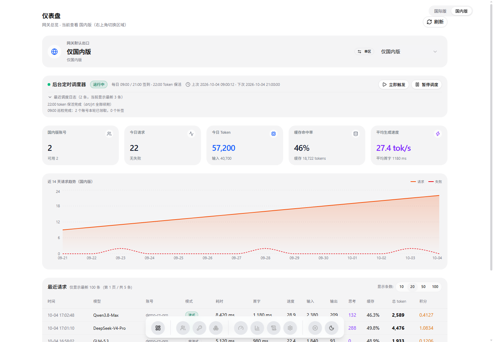
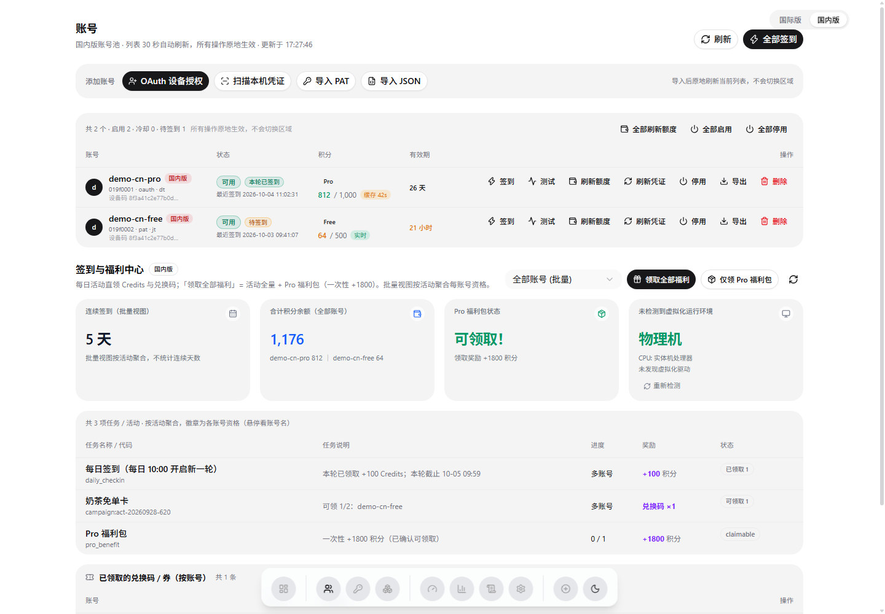
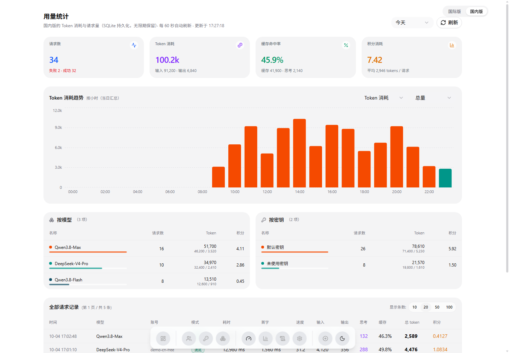
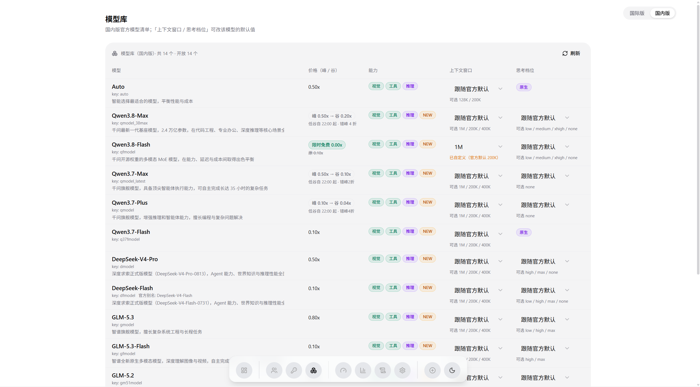

# Qoder2API

<p align="center">
  
  
  
  
  
  
</p>

把 **[qoder.com.cn](https://qoder.com.cn)**（国内版）与 **[qoder.com](https://qoder.com)**（国际版）的原生服务封装成标准 OpenAI 兼容接口，并配一套**全新重写的 Web 控制台**：多账号管理、每日签到与福利、模型库、性能与用量透视、实时日志，全部集中在一个页面体系里。

后端为零第三方依赖的纯 Python 标准库实现（含 COSY 签名、AES/RSA/GCM/DPAPI/QMC 全套密码学），前端为 Next.js 15 + React 19 + TypeScript + Tailwind v4 + shadcn/ui —— 构建产物已入库，最终用户**不需要 Node**。

> 本仓库是独立维护的分支：上游为 [shuishuipingan/qoder2api-hub](https://github.com/shuishuipingan/qoder2api-hub)（协议逆向与早期实现），前端的整套界面、用量统计、账号页交互与大量修复由本仓库重写完成。

---

## 🖼️ 控制台一览

**仪表盘** —— 双区出口状态、后台调度器、今日 KPI、14 天趋势与最新请求流水一屏尽览：



**账号** —— 头像 + 昵称 + 区域徽章一行看全；积分带来源标注（实时 / 缓存 / 快照）、本轮签到状态、逐账号操作；下方是签到与福利中心（活动聚合 + 兑换码）：



**用量统计** —— SQLite 持久化（无限期保留），按时间 / 模型 / 密钥维度统计请求量、Token 与积分；趋势图随范围切换；底部是**全量**请求记录（服务端分页）：



**模型库** —— 清单与官方桌面版同源：官方模型名、峰谷价与低谷高亮、上下文多窗口、思考档位、能力徽标，窗口/档位的默认值可直接改：



控制台其余页面：**密钥**（多 Key 管理与出口绑定）、**统计**（TTFT / 速度 / 缓存命中与 P95）、**日志**（实时日志流 + 导出）、**设置**（面板密码、网络代理、机器身份、新版本检测）。

---

## ✨ 核心能力

- **OpenAI 兼容双协议**：`/v1/chat/completions` 与 `/v1/responses`（Codex / Claude Code）；custom freeform 工具（`apply_patch`）双向转译、DSML 工具调用回退、泄漏工具调用文本回读（上游 issue #8/#9）。
- **双区三档出口**：仅国际 / 仅国内 / 双区自动切换（优先区失效自动切到另一区，恢复后切回）；区域独占模型强制路由；Key 可绑定独立出口。
- **多账号池 + 智能调度**：稳定物理设备指纹隔离（`derive_id`）、额度感知两档轮询、连续失败阶梯退避、least-busy 在途感知、会话粘性命中上游 prompt 缓存。
- **每日签到与福利（双区域真实领取）**：活动平台直接领取（每日 100 Credits、券/兑换码类），官方幂等不漏领不虚报；同人去重识别、按 10:00 轮次窗口判定「本轮已签到」；Pro 福利包（+1800）领取；后台调度器每日 09:00/21:00 补签、22:00 Token 集中保活。
- **机器身份（风控桥）**：自动调用官方 `runtime-info.exe` 取真实机器身份（跨区借用；无客户端的环境可从本机「导出身份」粘贴固定）。
- **统一出站网络层**：跟随系统代理 / 手动代理 / 直连三档，看板即改即生效。
- **用量统计**：`usage.jsonl` 为唯一真源，SQLite 增量投影（小时/天双粒度）；按时间、模型、密钥维度出趋势与明细；每次请求显示实际消耗积分（免费模型 `billable:false` 不虚增）。
- **纯标准库密码学**：AES-128/256、RSA-PKCS1v15、GCM、DPAPI、QMC、Chromium os_crypt 解密，Docker alpine 下同样零依赖。

---

## 🚀 快速启动

### 本机（Windows）

双击 **`start-qoder-proxy.bat`**，保持窗口运行：

- **API 地址**：`http://127.0.0.1:8790/v1`
- **控制台**：`http://127.0.0.1:8790/`（默认面板密码 `admin`，首次登录后请到「设置」修改）

首次启动无账号时，在控制台「账号」页用 **OAuth 设备授权 / 扫描本机凭证 / PAT / JSON** 任一方式导入。默认端口 8790，`start-qoder-proxy.bat 8791` 可改。

> 网关生命周期就是那个 cmd 窗口：窗口关掉网关即停（刻意设计，不留后台进程）。
> 排查「客户端一个字都不吐」：`python scripts/_diag_gateway.py --chat` 逐项报出断在哪。

### 局域网共享

双击 **`start-qoder-proxy-lan.bat`**：随机生成并持久化 `qd-` 前缀 API Key，局域网设备用 `http://<本机IP>:8790/v1` 接入；连不上时管理员运行一次 `allow-firewall.bat`。

### Docker

```bash
docker compose up -d
docker compose logs -f
```

持久化目录：`./accounts`（凭证与设置）、`./usage`（请求流水与统计库）；环境变量 `API_KEY`、`PORT`。

---

## 🔌 客户端接入

```bash
# OpenAI 兼容客户端（Chatbox / Cherry Studio / NextChat …）
Base URL: http://127.0.0.1:8790/v1
API Key : 控制台「设置」里添加或复制的 Key（本机未开鉴权时可留空）

# Codex CLI / Claude Code（Responses API）
export OPENAI_BASE_URL="http://127.0.0.1:8790/v1"
export OPENAI_API_KEY="<控制台里绑定的 Key>"
```

模型名填 `/v1/models` 里的 **`id`**（官方模型名，如 `Qwen3.8-Max`）；`upstream_key`、人类别名、官方本地化名也都可解析。思考档位 / 上下文窗口支持 `reasoning_effort`、`thinking.budget_tokens`、`context_window` 等常见写法，并按**每个模型的合法档位表**归一化（不支持的档位上游会静默忽略）。

---

## 🧭 控制台要点

| 页面 | 你会做什么 |
|---|---|
| 仪表盘 `/` | 看双区出口、调度器、今日 KPI、14 天趋势、最近请求（最新 100 条预览） |
| 账号 `/accounts` | 添加/导入账号，逐账号签到、测试（免费模型 Qwen3.8-Flash）、刷新额度/凭证、启停、导出、删除；签到与福利中心（活动聚合、Pro 福利包、兑换码） |
| 密钥 `/keys` | 多 API Key 管理：命名、随机生成、出口绑定、启停、删除；明文查看需已改默认密码 |
| 模型 `/models` | 官方模型清单与逐字段元数据；改每个模型的默认上下文窗口 / 思考档位 |
| 用量 `/usage` | 时间 / 模型 / 密钥维度的 Token 与请求统计；**全量**请求记录（含每次请求积分） |
| 统计 `/stats` | TTFT 首字、生成速度、缓存命中、P95 延迟、按账号用量 |
| 日志 `/logs` | 实时日志流（级别/标签/搜索过滤）、导出 |
| 设置 `/settings` | 面板密码、网络代理（三档）、机器身份（导出/固定）、新版本检测 |

交互约定：所有操作**原地生效**（不跳视图、不清空列表）；账号列表 30 秒心跳自动刷新（隐藏标签页跳过、切回即刷）；用量页 60 秒自动刷新。

---

## 🔧 常用接口

| 方法 | 路径 | 说明 |
|---|---|---|
| POST | `/v1/chat/completions` | 标准 Chat Completions |
| POST | `/v1/responses` | Responses API（Codex / Claude Code） |
| GET | `/v1/models` | 模型列表（含能力、峰谷价、窗口、档位、`catalog_source`） |
| GET | `/ping` | 免鉴权探活（`pong`） |
| GET | `/health` | 完整运行状态 |
| GET | `/accounts` | 账号列表（含额度快照、冷却、在途） |
| POST | `/accounts/credits` | 刷新额度（`ttl=` 秒走服务端缓存） |
| POST | `/accounts/checkin` | 每日签到（单个 / 全部，只领 Credits 类） |
| GET | `/accounts/checkin-state` | 各账号「本轮已签到」状态（活动平台判定） |
| POST | `/accounts/test` | 连通测试（免费模型） |
| GET | `/tasks` | 签到状态、活动与资格、Pro 福利包、兑换码 |
| POST | `/tasks/run` `/tasks/travel` | 领取全部福利 / 仅 Pro 福利包 |
| GET | `/usage/stats` | 用量统计（`range=today\|7d\|30d\|custom`、`group=model\|key_id`） |
| GET | `/usage/recent` | 分页请求记录（`limit`≤100、可选 `from`/`to`） |
| GET | `/logs` | 日志流（`since_id` 增量拉取） |
| GET | `/diag/vm` | 本机虚拟化检测（官方风控桥 vmInfo） |
| GET | `/identity/export` | 导出本机机器身份（给无客户端的服务器固定用） |
| GET | `/update/check` | 新版本检测（6h 缓存） |

---

## 🛠️ 开发与测试

```bash
# 离线确定性测试（零网络）
python tests/test_qoder.py      # 628 项断言：密码学 KAT、COSY 签名、目录全字段、
                                # 签到/活动归一化、泄漏回读、Responses、调度器…
python tests/test_usagedb.py    # 用量统计 SQLite 聚合
python tests/test_static.py     # 前端静态托管的安全与路由判定

# 直接启动
python qoder_proxy.py --port 8790      # 等价：python -m qoder2api

# 辅助脚本（只读/自检为主）
python scripts/_diag_gateway.py --chat      # 端到端链路逐项诊断
python scripts/_diag_campaign.py            # 签到资格体检（为什么某个号没有活动）
python scripts/_refresh_catalog.py          # 客户端更新后刷新官方模型快照
python scripts/_verify_models.py --base http://127.0.0.1:8790   # 模型库逐项比对
```

前端（**只有改界面时才需要**；产物 `web/out` 已入库，后端直接托管）：

```bash
cd web
npm install
npm run dev            # :3000，API 反向代理到 :8790
npm run build:export   # 重新产出 web/out（改完请一并提交）
```

目录结构：

```
qoder2api/
├─ qoder_proxy.py          # 兼容入口（等价 python -m qoder2api）
├─ qoder2api/              # 后端包（纯标准库）
│  ├─ upstream.py responses.py      # 上游调用/COSY 签名、Responses 转换
│  ├─ accounts.py tasks.py scheduler.py  # 账号池/签到/调度
│  ├─ catalog.py models.py model_entry.py # 官方模型目录
│  ├─ usage.py usagedb.py           # 用量记账（JSONL 真源）+ SQLite 聚合
│  ├─ sign.py fingerprint.py net.py # 密码学、设备指纹、出站网络层
│  └─ api/                 # HTTP 路由与静态托管
├─ web/                    # 前端源码（产物 out/ 入库，后端托管）
├─ tests/  scripts/  docs/  legacy/
└─ accounts/  usage/       # 运行时数据
```

---

## 📜 版本与更新日志

早期版本（v1.1.x）的完整说明见 [Releases](https://github.com/shuishuipingan/qoder2api-hub/releases)；以下是本仓库的近期变更。

### v1.2.11

**测试按钮改测免费模型 Qwen3.8-Flash + 免费调用不再虚增积分统计（billable=false）**

- 「测试」按钮固定用 `Qwen3.8-Flash`（双区都有的官方免费模型）：额度耗尽的 Free 账号调计费模型必然 403，但免费模型仍可用——用计费模型测会把"没额度"误报成"账号废了"；测试结果顺带显示本次实扣积分（免费模型显示「0 积分（免费）」）。
- 免费调用不再虚增积分：上游对免费模型把名义成本照常写进 `credits` 字段并给 `billable: false`，现在一律记 0。
- 顺带说明一个易误判现象：国际版账号推理返回 `upstream status 403`（信封 `code=112` + `pricingUrl`）是**额度不足**（Free 计划 0/0），不是风控——风控的真实表现是静默过滤活动列表。

### v1.2.10

**账号页对齐 workbuddy 面板：进页面秒开不白屏 + 30 秒心跳 + 积分来源标注**

- 进页面/刷新不再转圈白屏：列表（毫秒级）先渲染 → 签到状态（活动平台，1-4 秒）到货后合并徽标 → 额度在后台按服务端 TTL 补；骨架屏只在"确实没有数据"时出现，模块级缓存让再次进入直接有数据。
- `useHeartbeat`（workbuddy 同款）：列表 30 秒、签到状态 10 分钟自动刷新，隐藏标签页跳过、切回即刷；「刷新」按钮只在手动时转圈。
- 额度刷新并行化 + `POST /accounts/credits` 支持 `ttl`：进入页面自动刷新传 60 秒（命中快照不打上游），手动刷新始终回源。
- 积分列标注来源（实时 / 缓存 Ns / 快照）：只有实时值按金额涂色；快照值一律灰字（"快照说 0"≠"确实没额度"）。

### v1.2.9

**积分列铺到仪表盘 + 修复 OAuth 设备授权弹窗链接整块置灰点不动**

- 「最近请求」与「全部请求记录」共用同一张表，表尾显示每次请求实际消耗积分（0 = 未计费，失败行 `—`，非零琥珀色标出）。
- OAuth 弹窗修复：等待授权阶段链接区块不再被 `pointer-events-none` 盖住；只有「切换区域、新链接未到」时才置灰旧链接。

### v1.2.8

**修复 /accounts/checkin 整个 500（函数内 import 遮蔽）+ 签到状态改按活动平台与轮次窗口**

- P0：函数内的 `from qoder2api import tasks as qoder_tasks` 把该名字变成整函数局部名，更早分支 `UnboundLocalError` → `/accounts/checkin` 必然 500（前端只见 Failed to fetch）。已删除并新增 AST 静态护栏防复发。
- 「已签到」改按轮次窗口（本地 10:00 滚动）+ 上游活动平台判定（`GET /accounts/checkin-state`）；活动判 CLAIMED 时回写本地时间戳；去掉按旧接口能力置灰签到按钮的误判。

### v1.2.7

**新增「用量统计」页（SQLite 持久化，按时间 / 模型 / 密钥维度）**

- 页面：时间范围四档 + 4 张 KPI + 趋势（Token/请求量 × 总量/模型/密钥）+ 按模型/密钥明细表；60 秒自动刷新。
- 存储：`usage/usage.db`（stdlib sqlite3，WAL）；`usage.jsonl` 仍是唯一真源，统计库是它的**增量投影**（字节 offset + 聚合行同事务提交，崩溃不重复计数），**无限期保留**，损坏可删库自动重建。
- 全部请求记录：底部内嵌完整请求日志（服务端分页），跟随上方时间范围；分页总数走 SQLite 聚合，不再每次翻页全扫 JSONL。账号列显示昵称而非 uid 前缀。
- 顺带修复：用量行的计费字段此前只读单数 `credit`（上游实际是复数 `credits`），积分统计恒为 0。

### v1.2.6

**移植上游 v1.2.0–v1.2.3（泄漏工具调用回读、机器头门控、Responses / 调度器 / 审计修复）**

- 泄漏的工具调用文本「回读」与截断回声丢弃（上游 issue #8/#9）；机器头门控（issue #10：派生假机器头会让服务端整条过滤活动列表）；
- Responses 三项修复（转换后请求体重试、`response.failed` 终态、`sequence_number` 续号）；
- 调度器状态落盘（重启不重放补签）；审计修复（reveal 默认密码拒绝、Pro 已领取不虚增、`/v1/completions` 404、导入白名单等）。

### v1.2.0 – v1.2.5（摘要）

- **v1.2.5**：券/兑换码类活动领取与落盘展示、官方中文活动名、全部账号按活动聚合、信封层 403/10605 冷却换号；
- **v1.2.4 / v1.2.3**：签到文案改「本轮」轮次窗口（10:00 滚动），杜绝"上午显示已签到"的误判；
- **v1.2.2 / v1.2.1**：机器身份导出改直接下载文件；支持「固定机器身份」（服务器无官方客户端时对齐本机真身份）；
- **v1.2.0**：移植上游当日 7 个提交（同人去重识别、活动资格诊断、本机虚拟化检测、`/tasks` 并行 + 缓存、新版本检测、跨区风控桥借用）。
- **前端重写（v1.1.4–v1.1.8 期间）**：Next.js 15 + shadcn/ui 全新控制台替代旧 dashboard.html（底栏四组：总览 / 运营 / 治理 + 动作），后端托管静态产物；v1.2.10 起账号页对齐 workbuddy 面板交互。

---

## 🙏 致谢与引用声明

本项目的协议兼容、COSY 签名与设备授权链路参考了开源社区的逆向成果，按惯例致谢：

- **[shuishuipingan/qoder2api-hub](https://github.com/shuishuipingan/qoder2api-hub)**：本仓库的上游（协议逆向、后端早期实现与本文档里的技术说明来源）。
- **[mmqz/cpa-multi-plugins](https://github.com/mmqz/cpa-multi-plugins)**：双区域常量表、OAuth 设备授权与 PAT 交换、COSY 签名与自定义 Base64 的验证实现；签到与保活排程设计。
- **[Liki4/qodercli2api](https://github.com/Liki4/qodercli2api)**：Qoder OAuth 与推理协议逆向全记录。
- **[Sliverkiss/workbuddy2api](https://github.com/Sliverkiss/workbuddy2api)**：设备指纹稳定派生设计、整点排程理念、DeepSeek 多轮思维链回填；控制台的信息架构与交互基准。

---

## ⚖️ 免责声明

1. 本项目为非官方自托管网关，仅供技术研究、逆向协议学习与个人合法授权账号在私有环境测试使用。
2. 本项目不提供任何账号及额度。请严格遵守官方服务条款，禁止用于任何商业转售、恶意并发或违规滥用。
